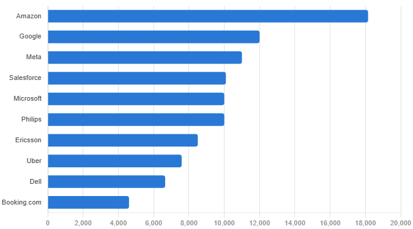
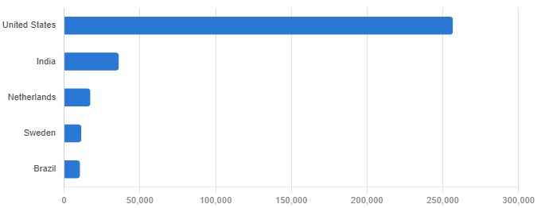
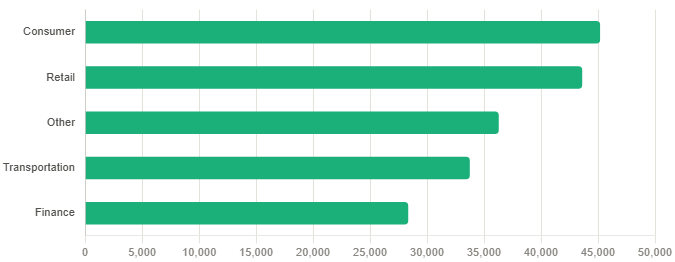
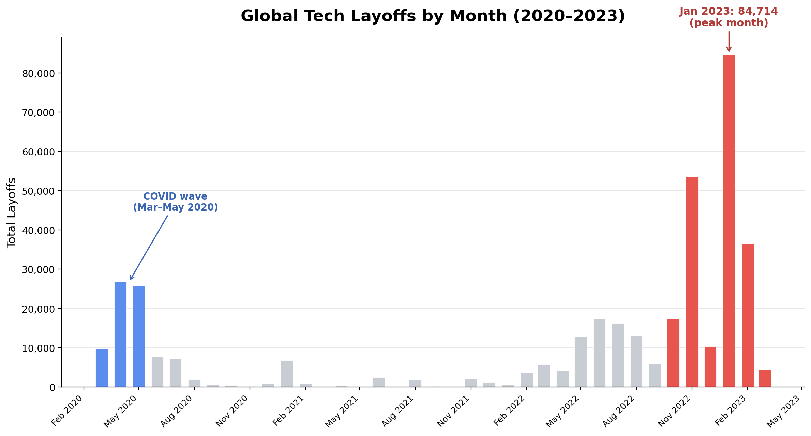
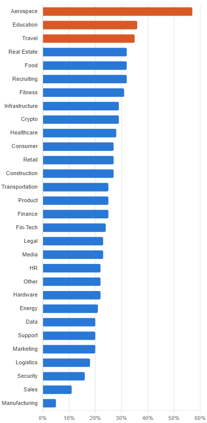
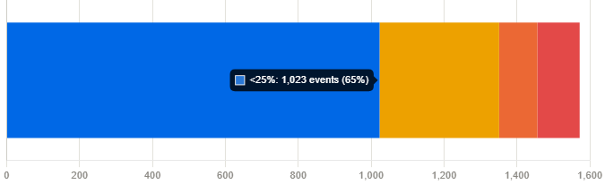

# Introduction
In recent years, global layoffs have nearly swept through each and every industry. In this analysis, we dive through this dataset of global tech layoffs to uncover which industries, countries, and companies were hit the hardest, how layoffs trend over time, and in what areas the most severe cuts occurred. 

Dive through my SQL queries here: [global_tech_layoffs_project folder](/SQL%20Work/layoffs%20project/global_tech_layoffs_project/)

# Background
Driven by curiosity about the recent wave of layoffs across the tech industry, this analysis is intended to find meaningful trends amongst a real-world dataset, where I can turn raw and messy data into a reliable source for analysis. Ultimately, I want to help job seekers evaluate the relative risk of different industries, company profiles, and geographies before accepting a role by using historical layoff patterns to identify where cuts are more frequent, more severe, or more likely to be total shutdowns.

### Questions I Answered:
Throughout this project, I aim to answer these questions through my SQL queries: 
1. What is the largest single layoff event, and which companies laid off 100% of their staff?
2. Which companies laid off the most employees overall?
3. Which industries and countries were hit the hardest?
4. How did layoffs trend month-over-month and year-over-year?
5. Which companies led layoffs in each individual year?
6. Which industries had the highest average layoff severity?
7. How are layoff events distributed across severity brackets and tiers?

# Tools I Used
I found the following tools useful in my SQL project:
- **SQL:** The backbone of both the cleaning and analysis phases, where I transformed raw, complex data into gathering actionable insights.
- **PostgreSQL:** The database for storing and querying this dataset.
- **Visual Studio Code:** My go-to editor for writing and running SQL queries.
- **Git & GitHub:** For sharing my SQL scripts and project tracking.

# Data Cleaning
Before exploring my dataset through my analysis, the dataset needed necessary cleaning to be done:
- Removed duplicate records using ``` ROW_NUMBER()``` partitioned across every column 
- Standardized inconsistent text values (e.g. different variations of "Crypto" collapsed into one)
- Converted ```date``` from text to a proper ```DATE``` type, and ```percentage_laid_off``` from text to ```NUMERIC``` data type.
- Filled in missing ```industry``` values using other records from the same company
- Removed rows with no usable layoff data (both ```total_laid_off``` and ```percentage_laid_off``` null)

Fully cleaned script:[data_fully_cleaned](/SQL%20Work/layoffs%20project/csv%20results/cleaned_data.csv)

# The Analysis
Each query in this analysis targets a specific question about global layoffs. Here is how I approached each one:

### 1. Largest Layoff & Full Shutdowns
In order to better understand the extremities of layoff events, I filtered down to look at the single largest layoff event by headcount, as well as each company that laid off 100% of its employees.
```sql
/* find the single largest layoff event by raw headcount */
SELECT *
FROM layoffs_staging2
WHERE total_laid_off = (SELECT MAX(total_laid_off) FROM layoffs_staging2);

/* view every company that laid off 100% of its staff, ordered by funding raised
   to highlight the most well-funded companies that still shut down completely */
SELECT *
FROM layoffs_staging2
WHERE percentage_laid_off = 1
ORDER BY funds_raised_millions DESC;
```
| Company | Industry | Country | Funds Raised | Employees Laid Off | Date |
|---|---|---|---|---|---|
| Britishvolt | Transportation | United Kingdom | $2.4B | 206 | Jan 2023 |
| Quibi | Media | United States | $1.8B | — | Oct 2020 |
| Deliveroo Australia | Food | Australia | $1.7B | 120 | Nov 2022 |
| Katerra | Construction | United States | $1.6B | 2,434 | Jun 2021 |
| BlockFi | Crypto | United States | $1.0B | — | Nov 2022 |

Breakdown of largest layoff and full company shutdowns from 2020-2023:
- **Largest layoff event:** The single largest layoff event was **Google's 12,000-employee cut** in January 2023, but it only contributed to **6%** of the total workforce. This implies that headcount and severity measure (percentage-wise) represent different concepts.
- **116 companies** in the dataset laid off its entire staff.
- Among the 116 shutdowns, 63% were US-based, but Food and Retail tied for the most complete shutdowns by industry (13 each), a different ranking than the raw-headcount leaders in Section 3.
- These five companies had raised **$8.5 billion** before shutting down completely. It serves as a reminder that heavy funding does not guarantee survival.

### 2. Companies with the Most Total Layoffs
In order to check which companies that cut the deepest overall, I summed total layoffs per company across all reported events.
```sql
SELECT company, SUM(total_laid_off) AS total_off
FROM layoffs_staging2
WHERE total_laid_off IS NOT NULL
GROUP BY company
ORDER BY 2 DESC
LIMIT 10;
```


The breakdown of the companies with the most layoffs from 2020-2023:
- **Amazon** led all companies with **over 18k** total layoffs, which is nearly 4x the amount of #10, Booking.com (4,601).
- The top 10 is dominated by major tech companies, including **Amazon**, **Google**, **Meta**, **Salesforce**, **Microsoft**, **Uber**, etc.
- Layoffs were concentrated amongst the largest and most established companies in tech, which suggests that cuts were more about scale than company health.
- For job seekers, this is a useful risk signal: company size and brand recognition do not equate to job security, as some of the most stable employers in tech were also the ones cutting the most.


### 3. Industries & Countries Hit Hardest
To identify which sectors and regions absorbed the most job losses, I aggregated total layoffs by industry and separately by country.
```sql
SELECT country, SUM(total_laid_off) AS total_off
FROM layoffs_staging2
WHERE total_laid_off IS NOT NULL
GROUP BY country
ORDER BY 2 DESC;

SELECT industry, SUM(total_laid_off) AS total_off
FROM layoffs_staging2
WHERE total_laid_off IS NOT NULL
GROUP BY industry
ORDER BY 2 DESC;
```





The breakdown for Industries and Countries hit the hardest:
- The **United States** accounted for the vast majority of layoffs at **256,559**, which represents itself as more than 7x the second-highest country, which is India (35,993).
- Top 5 countries account for **86.5%** of all layoffs, meaning the remaining **46** other countries share very little deviation.
- Country totals can be misleading, as **Philips** alone accounts for **58%** of **Netherlands'** total layoffs, while **Ericsson** accounts for **75%** of **Sweden's** (single companies drove these rankings).
- Geography was far more concentrated than industry, meaning that layoffs clustered heavily by country but were more evenly distributed across sectors.

### 4. Layoffs Over Time
I examined monthly totals and created an official rolling total across total layoffs over this timeline to see how layoffs tracked over time.

```sql
SELECT EXTRACT(YEAR FROM date) AS year, country, SUM(total_laid_off)
FROM layoffs_staging2
WHERE country = 'United States'
GROUP BY EXTRACT(YEAR FROM date), country
ORDER BY 1 DESC;

SELECT TO_CHAR(date, 'YYYY-MM') AS monthyear, SUM(total_laid_off)
FROM layoffs_staging2
WHERE date IS NOT NULL
GROUP BY monthyear
ORDER BY monthyear ASC;

WITH rolling_total AS (
    SELECT TO_CHAR(date, 'YYYY-MM') AS monthyear, SUM(total_laid_off) AS total_off
    FROM layoffs_staging2
    WHERE date IS NOT NULL
    GROUP BY monthyear
)
SELECT monthyear, total_off, SUM(total_off) OVER (ORDER BY monthyear) AS rolling_total
FROM rolling_total;
```



Breakdown of layoffs represented over time from 2020-2023:
- Layoffs represented two kinds of waves. The first, represented in **March-May 2020**, was a short-lived, but it was a sharp spike tied to the existence of COVID-19.
- The second, and bigger wave began during the middle of 2022 and peaked dramatically in **January 2023 at 84,714**, which represents itself as the highest month in the dataset. This is more than triple any month during the 2020 COVID wave.
- Of the **383,159 total layoffs** recorded, roughly **89%** occurred within the 12-month span from April 2022 through March 2023, showing that the more recent wave of tech layoffs was both larger in scale and more sustained than the initial pandemic-driven cuts.
- The single largest month-over-month jump in the dataset occurred from December 2022 to January 2023, which is a **+74,385** increase in one month, nearly matching the entire 2020 COVID wave's total **(80,998)** in a single month's jump.
- For job seekers, this timing pattern matters: layoffs are not evenly spread throughout the year, and being aware of historically volatile windows can inform when to negotiate, build up savings, or exercise more caution before accepting an offer.

### 5. Top Companies by Year
This query is designed to see which companies led the way in layoffs each individual year, as I ranked the companies within each year by total layofs, focusing on the top 5.

```sql
WITH company_year (company, years, total_laid_off) AS (
    SELECT company, EXTRACT(YEAR FROM date) AS years, SUM(total_laid_off)
    FROM layoffs_staging2
    WHERE total_laid_off IS NOT NULL
    GROUP BY company, EXTRACT(YEAR FROM date)
), company_years_rank AS (
    SELECT *,
        DENSE_RANK() OVER (PARTITION BY years ORDER BY total_laid_off DESC) AS ranking
    FROM company_year
    WHERE years IS NOT NULL
)
SELECT *
FROM company_years_rank
WHERE ranking <= 5;
```

| Year | #1 | #2 | #3 | #4 | #5 |
|---|---|---|---|---|---|
| 2020 | Uber (7,525) | Booking.com (4,375) | Groupon (2,800) | Swiggy (2,250) | Airbnb (1,900) |
| 2021 | Bytedance (3,600) | Katerra (2,434) | Zillow (2,000) | Instacart (1,877) | WhiteHat Jr (1,800) |
| 2022 | Meta (11,000) | Amazon (10,150) | Cisco (4,100) | Peloton (4,084) | Philips / Carvana (4,000) |
| 2023 | Google (12,000) | Microsoft (10,000) | Ericsson (8,500) | Amazon / Salesforce (8,000) | Dell (6,650) |

The breakdown for the top companies per year within the range of 2020-2023:
- The scale of layoffs grew each year. In 2020, **Uber** led the pack with 7,525, but by 2022, that number would only rank third, behind **Meta with 11,000 and Amazon with 10,150 layoffs**.
- **Amazon** is the only company to appear in the top 5 in back-to-back years (2022 and 2023). This reflects separate rounds of layoffs rather than a single event.
- The sector composition shifted noticeably. 2020–2021's top companies skew ride-share, travel, and real estate/ed-tech (Uber, Booking.com, Zillow, WhiteHat Jr), which are consumer sectors impacted by the pandemic. By 2022–2023, the list is dominated by social media, hardware, and enterprise tech giants **(Meta, Google, Microsoft, Ericsson, Dell)**, which is a shift from "industries hurt by COVID" to "Big Tech correcting after over-hiring."
- For job seekers, this signals that even top-tier companies are not immune to rounds of cuts: Amazon's back-to-back appearance serves as a reminder that a single 'safe-looking' layoff does not guarantee stability in the following year.

### 6. Average Layoff Severity By Industry
This query is ran to see which industries were cutting the deepest proportionally, as I calculated the average layoff percentage based on industry.

``` sql
 ROUND(AVG(percentage_laid_off), 2) AS avg_layoff_percentage
FROM layoffs_staging2
WHERE percentage_laid_off IS NOT NULL
GROUP BY industry
ORDER BY avg_layoff_percentage DESC;
```



The breakdown of average layoff severity by industry: 
- Although **Consumer and Retail** led in total headcount in total layoffs, they were not the most severely affected proportionally.
- **Aerospace** had by far the highest average layoff severity with **57%** of workforce per event, which is more than double the overall industry average **(25.5%)**, the sharpest outlier in the dataset.
- Raw total layoffs and layoff severity tell different narratives: an industry can be dominant by total headcount but does not mean they are the hardest-hit relative to its size of the industry.
- Nearly half of all industries (13/30) cluster tightly between the **20-25%** average severity, which means the real story is represented by the small group of outliers at each extreme rather than a smooth spread.

### 7. Layoff Severity Distribution
To truly grasp how common extreme layoff events were vs the more modest events, I separated each event into severity tiers.

``` sql
SELECT 
  CASE
    WHEN percentage_laid_off = 1 THEN '100%'
    WHEN percentage_laid_off >= 0.5 THEN '50–99%'
    WHEN percentage_laid_off >= 0.25 THEN '25–49%'
    ELSE '<25%'
  END AS layoff_severity,
  COUNT(*) AS events
FROM layoffs_staging2
WHERE percentage_laid_off IS NOT NULL
GROUP BY layoff_severity
ORDER BY events DESC;
```



The breakdown of layoff severity distribution tiers:
- Of the 221 events classified as severe **(50%+ layoffs)**, **52.5%** resulted in a complete shutdown, suggesting that once layoffs cross the halfway mark, companies are more than likely to fail in its entirety. 
- Mild layoffs (less than 25%) outnumber complete shutdowns by nearly 9x, reinforcing the idea that for most companies, layoffs were a correction rather than a complete failure.

# What I Learned
Throughout this project, I strengthened several SQL skills and applications through learning more about the layoffs in specific industries and companies:
- **Data Cleaning at Scale**: I learned to identify and remove true duplicates using window functions rather than performing manual inspection.
- **Type Conversion & Standardization**: I was able to be more comfortable converting inconsistent text data into proper types, such as ```DATE``` and ```NUMERIC```, as well as resolving naming inconsistencies.
- **Window Functions & CTEs**: Used```ROW_NUMBER()```, ```DENSE_RANK()```, and running totals with ```SUM() OVER()``` to answer more advanced questions.
- **Self-Joins for Data Repair**: Used a self-join to fill in missing values from related rows.

# Conclusions

### Insights
1. **Largest Layoff & Full Shutdowns**: The largest layoff by headcount **(Google, 12,000)** represented only **6%** of that company's workforce, while 116 companies laid off 100% of their staff. Raw numbers and severity do not represent the same story.
2. **Companies with the Most Total Layoffs**: **Amazon**, **Google**, and **Meta** led total layoffs by company, with the top 10 dominated almost entirely by large, established tech firms, suggesting that scale and not company health, drove much of the volume.
3. **Industries & Countries Hit Hardest**: The U.S. accounted for over 7x the layoffs of the next-highest country, while single companies like **Philips** disproportionately drove their totals, as geography was far more concentrated than industry.
4. **Layoffs Over Time**: A short, but sharp COVID-19 driven spike in early 2020 was followed by a large wave from the middle of 2022 through early 2023, as January 2023 accounting for the single highest monthly total within the dataset.
5. **Top Companies by Year**: The scale of the year's largest single-company layoff increased sharply each year, as **Amazon** was the only company to appear in the top 5 across back-to-back years. This suggests that even top-tier companies are not immune to repeated rounds of cuts.
6. **Average Layoff Severity by Industry**: **Aerospace** had the highest average layoff severity **(57%)** despite not leading in total acount, proving that industries hit hardest by volume are not always hit severely proportionally wise.
7. **Layoff Severity Distribution**: **65%** of all layoff events cut less than 25% of a company's workforce, and complete shutdowns were slightly more common than layoffs in the **50-99%** range, as it suggests that companies rarely survive once cuts become severe.

### Closing Thoughts
This project strengthened my SQL data cleaning and analytical skills, while providing a clearer picture of the scale and distribution of tech industry layoffs. The process reinforced how much upfront data cleaning shapes the reliability of any downstream analysis, particularly around how window functions and CTEs unlock more nuanced business questions than simple aggregations alone. Beyond the technical takeaways, this analysis reinforces the original goal behind the project: layoffs are not random or evenly distributed. They cluster by company, by industry, by geography, and by time. For job seekers, understanding these patterns doesn't eliminate risk, but it does turn an abstract fear into something measurable, which is a factor that can be weighed alongside salary, role, and growth potential when evaluating where to work next.